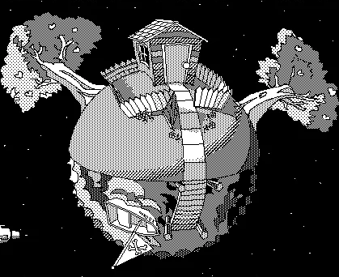

# __Planet Profit__

### by [James Benjamin Pawlik](http://github.com/jbpawlik)

### __Description__

Planet Profit is a website for companies trading in cosmic capitalism. Interplanetary employers can use Planet Profit to find astronauts to work across the solar system. Demographics about the employee are used to find their projected lifespan, their age in other planets' years, and how many years the employee can expect to "enjoy" on other planets. It determines which employees have enjoyed a greater lifespan than average in order to better recruit their children for future employment.

### __Technologies Used__
Planet Profit uses custom HTML and CSS (with Bootstrap). JavaScript and JQuery are used for the business and interface logic. The development environment is created with Node Package Manager and managed with webpack. De-linting is done by eslint. Testing performed using Jest. Babel has been used to bridge compatibility gaps.

### __Setup/Installation__
1. Download or clone the [repository](http://github.com/jbpawlik/galactic-age) to your local machine
2. Navigate to the top level of the directory
3. After installing Node Package Manager, run "npm run build" in your terminal, then "rpm run start" to open a live server. Or, open the index.html file in your browser.

Alternately, visit [Github Pages](http://jbpawlik.github.io/galactic-age) to view the site.

### __Tests/Specifications__
Full tests and specifications can be found in the __tests__ folder in the directory.

### __Known Bugs / Future Goals__
No bugs have been found or reported. Please contact the author if you experience poor performance.

Future goals for __Planet Profit__:
1. Input the employee's birthday so that the employer won't forget to send an encouraging birthday email each year, no matter which planet the employee lives on. This will make the employee feel valued and improve morale.
2. Support for the other planets in the solar system. They might not profitable - er, habitable - at the moment, but humanity's thirst for profit will find a way.

### __License__
This software is licensed under the [BSD license](license.txt).

Copyright (c) 2021 James Benjamin Pawlik

### __Contact Information__
Contact the author at __james.benjamin.pawlik@gmail.com__
